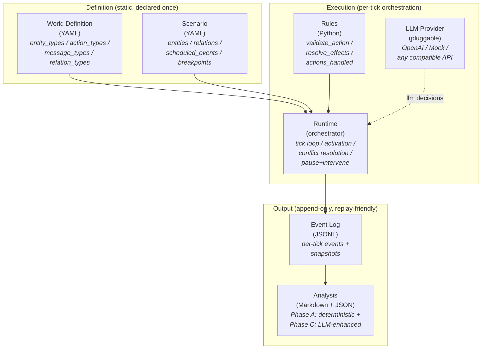

# Polisim

> **Layered LLM-driven multi-agent simulation engine.** Define worlds in YAML, recreate social dynamics, pause and intervene mid-simulation.
>
> 分层驱动的多实体仿真引擎 · LLM agents · YAML 定义世界 · 可暂停 / 可干预 / 可回溯分析

[](LICENSE)
[](https://www.python.org/downloads/)
[](#testing)
[](#architecture)

---

## What is Polisim?

Polisim is a **simulation engine** for running multi-entity scenarios where **LLM agents** make decisions inside a **structured, observable, interruptible world**.

You describe the world in a YAML file (entities, actions, message types, relations), declare a scenario (specific instances + initial state + breakpoints), and write a small Python rules module (how actions become effects). Polisim then:

- Drives a tick-based simulation where each entity's decision can come from an LLM, a deterministic rule, or a random fallback
- Records every event to an append-only log + per-tick snapshots, so any moment is **replayable / inspectable**
- Lets you pause at any tick, intervene by injecting messages or forcing actions, then resume
- Generates a **dual-track analysis report** at the end: a deterministic Phase A track (turning points, entity trajectories, environment dynamics) plus an optional LLM-enhanced Phase C track (situation judgment, narrative summary, action suggestions)

Built for narrative simulations of **markets, negotiations, opinion dynamics, organizational decision-making**—any domain where you want to ask *"what happens when these agents interact under these rules?"*

## Key features

- 🏛 **6-layer architecture** with strict layer boundaries (World / Scenario / Rules / Runtime / Event Log / Analysis)
- 🤖 **Three decision modes coexist**: `llm` (any OpenAI-compatible provider), `rule` (deterministic), `random` (sampling)
- 📜 **YAML-defined worlds** with full schema validation (JSON Schema + Pydantic + cross-layer semantic checks)
- ⏸ **Pause / resume / intervene** at any tick—force actions, inject messages, modify entity attributes mid-run
- 📊 **Dual-track analysis**: deterministic statistics (always on) + optional LLM-narrated summary
- 🧪 **670 passing tests**, including end-to-end CLI tests for two production-ready scenarios
- 🛠 **Extensible by design**: bring your own rules module, your own LLM provider, your own analysis enhancers

## Quick start

### Installation

```bash
git clone https://github.com/Kaka-cheaper/Polisim.git
cd Polisim
pip install -e ".[dev]"
```

Requires Python 3.10+.

### Run the minimal market scenario (5 ticks)

```bash
python -m cli run scenarios/minimal_market/scenario.yaml --ticks 5
```

Sample output:

```text
[run_id] minimal-market_2026-04-26T10-30-00_a1b2
[t=  1] decision_proposed actor=company_a action=do_nothing mode=llm
[t=  1] decision_proposed actor=company_b action=promote mode=rule
[t=  1] action_executed actor=company_b
[t=  1] attribute_changed actor=company_b cash: 100 -> 80
[t=  1] attribute_changed actor=company_b reputation: 50 -> 55
[t=  1] snapshot_saved tick=1
...
[final] tick=5 events=42 entities=2
[analysis] final.md (Phase A) -> runs/minimal-market_.../analysis/
```

### Run with real OpenAI (Phase B)

```bash
$env:OPENAI_API_KEY = "sk-..."  # or any OpenAI-compatible endpoint
python -m cli run scenarios/three_party_negotiation/scenario.yaml `
    --llm-provider openai --ticks 8
```

### Add LLM-enhanced analysis (Phase C)

```bash
python -m cli run scenarios/minimal_market/scenario.yaml `
    --llm-enhance --output-language zh-CN
```

The final report at `runs/<run_id>/analysis/final.md` will include a narrative summary, situation judgment, and action suggestions in Chinese (or any configured language).

## Architecture



The 6 layers communicate **only through declared interfaces**—no cross-layer pollution. This makes each layer independently testable and replaceable: swap rules without touching runtime, swap LLM providers without touching scenarios, swap analysis without touching the event log.

## Built-in scenarios

### 1. `minimal_market` — Walkthrough scenario (2 entities, 5 ticks)

Two competing companies (`company_a` LLM-driven, `company_b` rule-driven) decide between `promote` and `do_nothing` based on cash, reputation, and a global `market_pressure` environment variable. Demonstrates: basic action effects, attribute clamping, scheduled events, snapshot lifecycle.

```bash
python -m cli run scenarios/minimal_market/scenario.yaml
```

→ See [`scenarios/minimal_market/`](scenarios/minimal_market/)

### 2. `three_party_negotiation` — Architecture coverage scenario (3 entities, 8 ticks)

Three negotiators (Alice LLM, Bob rule, Charlie random) propose / accept / reject offers to each other. Trust relations evolve via `update_value`; reaching trust=80 triggers a breakpoint. Demonstrates: directed messages, relation dynamics, multi-effect actions, pluggable decision modes, breakpoint-driven pause.

```bash
python -m cli run scenarios/three_party_negotiation/scenario.yaml
```

→ See [`scenarios/three_party_negotiation/`](scenarios/three_party_negotiation/)

## Project structure

```text
Polisim/
├── cli/                    CLI entry point (run / step / replay)
├── core/                   Orchestration layer
│   ├── runtime.py          Tick loop, activation, conflict resolution
│   ├── analysis.py         Phase A + Phase C analysis
│   ├── semantic_validator.py  D-013 cross-layer semantic checks
│   ├── definition_loader.py   World loading + schema validation
│   ├── scenario_loader.py     Scenario loading + cross-file refs
│   ├── rules_loader.py     Dynamic rules module loader (D-010)
│   ├── llm_policy.py       LLM protocol layer
│   ├── events.py           Append-only event log + snapshots
│   ├── errors.py           Unified SimEngineError hierarchy (D-011)
│   └── providers/          LLMProvider ABC + OpenAI / Mock impls
├── models/                 Pydantic models (world / scenario / runtime / config / analysis)
├── rules/                  Rules modules (BaseRules + 2 concrete impls)
├── schemas/                JSON schemas (single source of truth)
├── scenarios/              YAML scenarios (minimal_market + three_party_negotiation)
├── tests/                  670 tests across all layers
└── docs/                   Design docs / requirements / pitfalls / progress
```

## Documentation

All design and process documentation is in `docs/`:

| Document | What's inside |
|---|---|
| [`AGENTS.md`](AGENTS.md) | Entry point for AI coding assistants—MUST/MUST NOT rules + doc navigation |
| [`docs/00-overview/progress.md`](docs/00-overview/progress.md) | Session-to-session progress log; current state and next steps |
| [`docs/00-overview/如何使用这套文档与配置体系.md`](docs/00-overview/如何使用这套文档与配置体系.md) | Human-facing intro to the doc system |
| [`docs/01-requirements/验收标准.md`](docs/01-requirements/验收标准.md) | Acceptance criteria—**source of truth when implementation diverges from docs** |
| [`docs/01-requirements/最小示例Walkthrough.md`](docs/01-requirements/最小示例Walkthrough.md) | Step-by-step walkthrough of the minimal_market scenario |
| [`docs/02-design/`](docs/02-design/) | 8 design docs covering each architectural layer |
| [`docs/03-implementation/pitfalls.md`](docs/03-implementation/pitfalls.md) | Known issues, edge cases, and pitfalls discovered during development |
| [`docs/00-overview/LLM辅助建模方案.md`](docs/00-overview/LLM辅助建模方案.md) | Roadmap for future LLM-assisted modeling (Phase 2) |

## Testing

```bash
pytest tests/ -q
```

Currently **670 tests passing** in ~12 seconds, covering:

- All Pydantic models (world / scenario / runtime / config / analysis)
- All loaders (definition / scenario / rules) with three-tier validation
- Runtime full lifecycle (step / run_until / pause+intervene / breakpoints / snapshot modes)
- Both rules modules (minimal_market + three_party_negotiation)
- LLM protocol (mock + OpenAI provider with mocked HTTP)
- Analysis (Phase A + Phase C with multi-language injection)
- CLI end-to-end (run / step / replay across both scenarios)
- Cross-layer semantic validation (D-013)

Plus a real-OpenAI smoke test at `scripts/smoke_openai.py` for end-to-end verification with live API calls.

## Roadmap

v1 minimum viable engine is **complete**. Next directions, by priority:

- **Phase 2**: LLM-assisted modeling—`core/modeling_loop.py` + guided Q&A frontend (see [`LLM辅助建模方案.md`](docs/00-overview/LLM辅助建模方案.md))
- **D-012**: DSL form decision—keep YAML or invent higher-level abstraction
- **Phase B.3**: Protocol-level retry with exponential backoff (currently relying on OpenAI SDK's built-in retries)
- **Walkthrough expansion**: extend the existing markdown walkthrough to cover multi-entity / breakpoints / interventions in detail
- **More scenarios**: information cascade, opinion dynamics, organizational decision-making

See [`progress.md`](docs/00-overview/progress.md) section "下一步该做什么" for the live priority list.

## Contributing

This is currently a single-developer project being shaped session-by-session. If you want to:

- **Report a bug or pitfall**: open an issue with reproduction steps; pitfalls discovered during development are logged in [`pitfalls.md`](docs/03-implementation/pitfalls.md)
- **Propose a new scenario**: open a discussion describing the world / entities / actions / what dynamics you want to study
- **Contribute code**: read [`AGENTS.md`](AGENTS.md) first—it lists the architectural rules that any contributor (human or AI) must follow

## License

[MIT](LICENSE)

## Acknowledgments

The architectural discipline of this project is heavily influenced by:
- **Layered orchestration patterns** from compiler design and game engines
- **Append-only event logs** from event sourcing and CQRS
- **Multi-agent decision protocols** from contemporary LLM agent frameworks ([AgentVerse](https://github.com/OpenBMB/AgentVerse), [AutoGen](https://github.com/microsoft/autogen), [CrewAI](https://github.com/joaomdmoura/crewAI))
- **Configuration validation** from `pydantic` and JSON Schema
