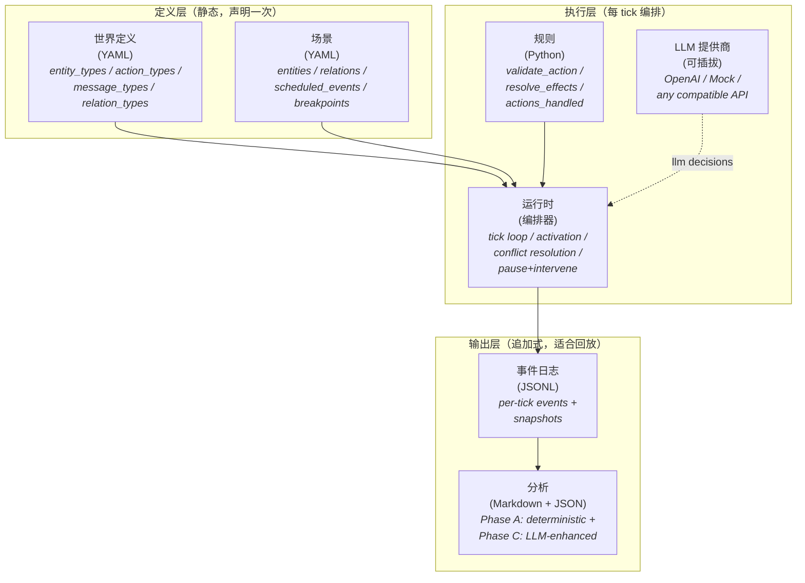

# Polisim

> **分层驱动的多实体仿真引擎。** 通过 YAML 定义世界，重建社会动态，可在仿真中途暂停和干预。

[](LICENSE)
[](https://www.python.org/downloads/)
[](#testing)
[](#architecture)

---

## Polisim 是什么？

Polisim 是一个**仿真引擎**，用于运行多实体场景，其中 **LLM 智能体**在一个**结构化、可观察、可中断的世界**中做出决策。

你通过 YAML 文件描述世界（实体、动作、消息类型、关系），声明一个场景（特定实例 + 初始状态 + 断点），并编写一个小型 Python 规则模块（动作如何产生效果）。然后 Polisim 会：

- 驱动一个基于 tick 的仿真，每个实体的决策可以来自 LLM、确定性规则或随机回退
- 将每个事件记录到追加式日志 + 每 tick 快照中，因此任何时刻都是**可回放 / 可检查**的
- 允许你在任何 tick 暂停，通过注入消息或强制动作进行干预，然后恢复
- 在结束时生成**双轨分析报告**：确定性的 A 阶段轨迹（转折点、实体轨迹、环境动态）加上可选的 LLM 增强 C 阶段轨迹（态势判断、叙事总结、行动建议）

专为**市场、谈判、舆论动态、组织决策**的叙事仿真而构建——任何你想回答"当这些智能体在这些规则下交互时会发生什么？"的领域。

## 核心特性

- 🏛 **6 层架构**，具有严格的层边界（世界 / 场景 / 规则 / 运行时 / 事件日志 / 分析）
- 🤖 **三种决策模式共存**：`llm`（任何兼容 OpenAI 的提供商）、`rule`（确定性）、`random`（采样）
- 📜 **YAML 定义世界**，具有完整的 schema 验证（JSON Schema + Pydantic + 跨层语义检查）
- ⏸ **暂停 / 恢复 / 干预**——在任何 tick 强制动作、注入消息、修改实体属性
- 📊 **双轨分析**：确定性统计（始终开启）+ 可选的 LLM 叙述总结
- 🧪 **670 个通过的测试**，包括两个生产就绪场景的端到端 CLI 测试
- 🛠 **设计上可扩展**：自带规则模块、LLM 提供商、分析增强器

## 快速开始

### 安装

```bash
git clone https://github.com/Kaka-cheaper/Polisim.git
cd Polisim
pip install -e ".[dev]"
```

需要 Python 3.10+。

### 运行最小市场场景（5 ticks）

```bash
python -m cli run scenarios/minimal_market/scenario.yaml --ticks 5
```

示例输出：

```text
[run_id] minimal-market_2026-04-26T10-30-00_a1b2
[t=  1] decision_proposed actor=company_a action=do_nothing mode=llm
[t=  1] decision_proposed actor=company_b action=promote mode=rule
[t=  1] action_executed actor=company_b
[t=  1] attribute_changed actor=company_b cash: 100 -> 80
[t=  1] attribute_changed actor=company_b reputation: 50 -> 55
[t=  1] snapshot_saved tick=1
...
[final] tick=5 events=42 entities=2
[analysis] final.md (Phase A) -> runs/minimal-market_.../analysis/
```

### 使用真实 OpenAI 运行（B 阶段）

```bash
$env:OPENAI_API_KEY = "sk-..."  # 或任何兼容 OpenAI 的端点
python -m cli run scenarios/three_party_negotiation/scenario.yaml `
    --llm-provider openai --ticks 8
```

### 添加 LLM 增强分析（C 阶段）

```bash
python -m cli run scenarios/minimal_market/scenario.yaml `
    --llm-enhance --output-language zh-CN --prompt-history-size 3
```

在 `runs/<run_id>/analysis/final.md` 的最终报告将包含四个 LLM 生成的部分（配置语言）：

- **世界概览** — 用自然语言解释初始实体、属性、关系和场景目标
- **叙事总结** — 用自然语言描述轨迹，并引用 tick
- **态势判断** — 最终状态评估，引用证据（特定 tick + 属性变化）
- **下一步行动建议** — 可操作的建议，每条建议都嵌入支持证据

`--prompt-history-size N` 控制最近多少个决策（D-016）被注入到每个 LLM prompt 的 `actor_view.recent_decisions` 中（默认为 3，范围 0-10）。

## 架构



6 层仅通过**声明的接口**通信——无跨层污染。这使得每层都可以独立测试和替换：交换规则而不触及运行时，交换 LLM 提供商而不触及场景，交换分析而不触及事件日志。

## 内置场景

### 1. `minimal_market` — 入门场景（2 实体，5 ticks）

两个竞争公司（`company_a` 由 LLM 驱动，`company_b` 由规则驱动）根据现金、声誉和全局 `market_pressure` 环境变量在 `promote` 和 `do_nothing` 之间做出决定。演示：基本动作效果、属性限制、定时事件、快照生命周期。

```bash
python -m cli run scenarios/minimal_market/scenario.yaml
```

→ 参见 [`scenarios/minimal_market/`](scenarios/minimal_market/)

### 2. `three_party_negotiation` — 架构覆盖场景（3 实体，8 ticks）

三位谈判者（Alice LLM、Bob 规则、Charlie 随机）互相提议 / 接受 / 拒绝报价。信任关系通过 `update_value` 演变；达到 trust=80 触发断点。演示：定向消息、关系动态、多效果动作、可插拔决策模式、断点驱动暂停。

```bash
python -m cli run scenarios/three_party_negotiation/scenario.yaml
```

→ 参见 [`scenarios/three_party_negotiation/`](scenarios/three_party_negotiation/)

## 项目结构

```text
Polisim/
├── cli/                    CLI 入口（run / step / replay）
├── core/                   编排层
│   ├── runtime.py          Tick 循环、激活、冲突解决
│   ├── analysis.py         A 阶段 + C 阶段分析
│   ├── semantic_validator.py  D-013 跨层语义检查
│   ├── definition_loader.py   世界加载 + schema 验证
│   ├── scenario_loader.py     场景加载 + 跨文件引用
│   ├── rules_loader.py     动态规则模块加载器（D-010）
│   ├── llm_policy.py       LLM 协议层
│   ├── events.py           追加式事件日志 + 快照
│   ├── errors.py           统一的 SimEngineError 层次结构（D-011）
│   └── providers/          LLMProvider ABC + OpenAI / Mock 实现
├── models/                 Pydantic 模型（world / scenario / runtime / config / analysis）
├── rules/                  规则模块（BaseRules + 2 个具体实现）
├── schemas/                JSON schemas（单一事实来源）
├── scenarios/              YAML 场景（minimal_market + three_party_negotiation）
├── tests/                  670 个测试覆盖所有层
└── docs/                   设计文档 / 需求 / 陷阱 / 进度
```

## 文档

所有设计和流程文档都在 `docs/` 目录中：

| 文档 | 内容 |
|---|---|
| [`AGENTS.md`](AGENTS.md) | AI 编码助手入口——MUST/MUST NOT 规则 + 文档导航 |
| [`docs/00-overview/progress.md`](docs/00-overview/progress.md) | session 进度日志；当前状态和下一步 |
| [`docs/00-overview/如何使用这套文档与配置体系.md`](docs/00-overview/如何使用这套文档与配置体系.md) | 面向人类的文档系统介绍 |
| [`docs/01-requirements/验收标准.md`](docs/01-requirements/验收标准.md) | 验收标准——**实现与文档不一致时以此为准** |
| [`docs/01-requirements/最小示例Walkthrough.md`](docs/01-requirements/最小示例Walkthrough.md) | minimal_market 场景的分步教程 |
| [`docs/02-design/`](docs/02-design/) | 8 个设计文档覆盖每个架构层 |
| [`docs/03-implementation/pitfalls.md`](docs/03-implementation/pitfalls.md) | 开发过程中发现的已知问题、边缘情况和陷阱 |
| [`docs/00-overview/LLM辅助建模方案.md`](docs/00-overview/LLM辅助建模方案.md) | 未来 LLM 辅助建模路线图（第二阶段）|

## 测试

```bash
pytest tests/ -q
```

目前 **670 个测试通过**，约 12 秒，覆盖：

- 所有 Pydantic 模型（world / scenario / runtime / config / analysis）
- 所有加载器（definition / scenario / rules），具有三层验证
- Runtime 完整生命周期（step / run_until / pause+intervene / breakpoints / snapshot modes）
- 两个规则模块（minimal_market + three_party_negotiation）
- LLM 协议（mock + 带 mocked HTTP 的 OpenAI 提供商）
- 分析（A 阶段 + C 阶段，支持多语言注入）
- CLI 端到端（run / step / replay，覆盖两个场景）
- 跨层语义验证（D-013）

另外在 `scripts/smoke_openai.py` 有一个真实 OpenAI 烟雾测试，用于通过实时 API 调用进行端到端验证。

## 路线图

v0.1.1 引擎严谨化**已完成**（D-014 强动作参数 + D-015（作用域）AttributeEffect.new_value + D-016 PromptContext / enrich_prompt hook + LLM 分析升级，带 `world_overview` + 证据引用）。下一个方向，按优先级排序：

- **v0.2 Web UI**：单仓库 monorepo 添加——FastAPI WebSocket 后端 + React 实时态势面板，消费 `decision_proposed.payload.prompt_context`（D-016 启用此功能）
- **D-015 完整**：`EntityCreate` / `EntityDestroy` / `ChainedAction` 效果类型（从 v0.1.1 推迟）
- **B.3 阶段**：协议级重试，带指数退避（目前依赖 OpenAI SDK 内置重试）
- **第二阶段 LLM 辅助建模**：`core/modeling_loop.py` + 引导式问答前端（D-013 语义验证器已提供"自我修复循环"基础设施；参见 [`LLM辅助建模方案.md`](docs/00-overview/LLM辅助建模方案.md)）
- **更多场景**：信息级联、舆论动态、组织决策

参见 [`progress.md`](docs/00-overview/progress.md) 的"下一步该做什么"部分获取最新优先级列表。

## 贡献

这目前是一个由单个开发者逐 session 塑造的项目。如果你想：

- **报告 bug 或陷阱**：打开 issue 并附上复现步骤；开发过程中发现的陷阱记录在 [`pitfalls.md`](docs/03-implementation/pitfalls.md)
- **提议新场景**：打开 discussion，描述世界 / 实体 / 动作 / 你想研究的动态
- **贡献代码**：先读 [`AGENTS.md`](AGENTS.md)——它列出了任何贡献者（人类或 AI）必须遵循的架构规则

## 许可证

[MIT](LICENSE)

## 致谢

这个项目的架构纪律深受以下影响：

- **编译器设计和游戏引擎**的分层编排模式
- **事件溯源和 CQRS**的追加式事件日志
- **当代 LLM 智能体框架**的多智能体决策协议（[AgentVerse](https://github.com/OpenBMB/AgentVerse)、[AutoGen](https://github.com/microsoft/autogen)、[CrewAI](https://github.com/joaomdmoura/crewAI)）
- **pydantic 和 JSON Schema**的配置验证